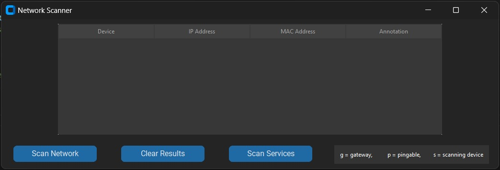
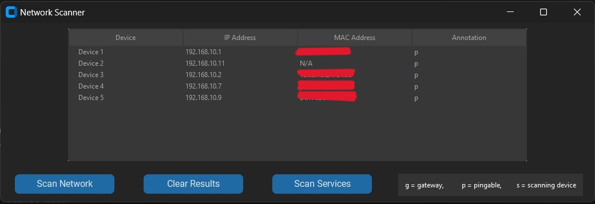
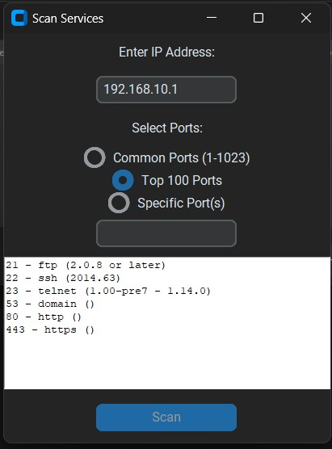

# Network Scanner
## _GUI based Python Network Scanner_

The Network Scanner is a Python application designed to scan a local network for devices and display their IP addresses, MAC addresses, and annotations. The application features a modern, dark-themed graphical user interface (GUI) built using the Tkinter library. It uses the Nmap library for network scanning and the ipaddress library for handling IP addresses.

## Features

- The application scans the local network for devices and displays their IP addresses, MAC addresses, and annotations.
- The GUI is designed with a modern, dark-themed style to provide a visually appealing user experience.
- Users can clear the scan results to perform a new scan or remove outdated information.
- Devices are annotated based on their characteristics, such as ping ability, status as a gateway, and running HTTP or HTTPS services.

The application is implemented in Python using the Tkinter library for the GUI and the Nmap library for network scanning. The get_network_address() function is used to retrieve the local IP address and subnet mask, and the scan_network() function performs the network scan using Nmap. The scan results are displayed in a Treeview widget in the GUI.
